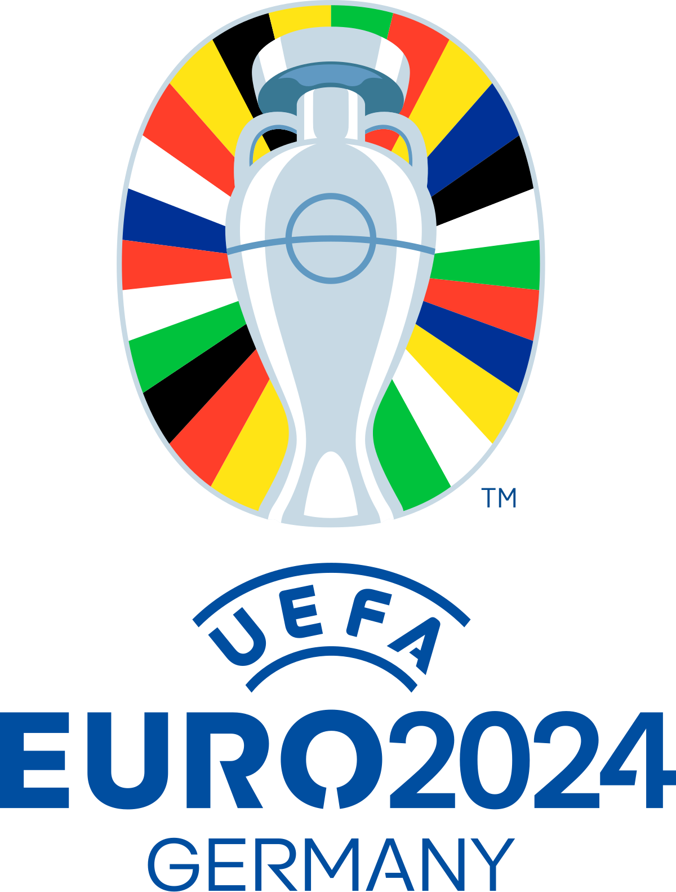

## ML Model for the European Football Championship 2024

The site presents the predictions of a machine learning model for the EURO 2024 games. The project is a fun project to play around with ML using [Lux.jl](https://lux.csail.mit.edu/stable/). It was trained to a [Kaggle dataset](https://www.kaggle.com/datasets/martj42/international-football-results-from-1872-to-2017?select=results.csv) of international football matches. Different models are compared (work in progress).

The code can be found in the [EUROml](https://github.com/se-schmitt/EUROml) Github repository.

  
